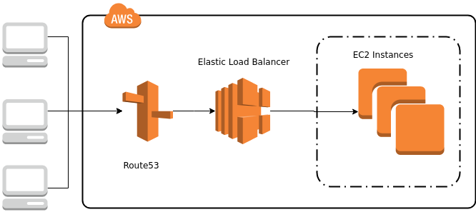

# Demo Infra

Here you'll find all required files to roll out the demo infrastructure as seen it the myBIZDEVOPS demo.



## Preparations

To try yourself make sure [Terraform](https://www.terraform.io/) is installed locally. Customize the vars.tf files to 
your needs. 

The servers are booted with a custom AMI (image) which contains the application. This AMI must be prepared and available in your
AWS account. To create it navigate to it's [GitHub Repo](https://github.com/mybizdevops/demo-images-packer).

In order to have the DNS and certificate portions working properly make sure the the Route53 zone is already created and your registrar
uses the required name servers.

## Run Terraform

Then run the following commands:

```
export TF_VAR_aws_access_key="[YOUR AWS ACCESS KEY ID]"
export TF_VAR_aws_secret_key="[YOUR AWS SECRET KEY]"
export TF_VAR_aws_ami="[ID OF AMI]"

# Verify changes
terraform plan

# Apply changes
terraform apply
```

Make sure to substitute the square backets in the command above.

